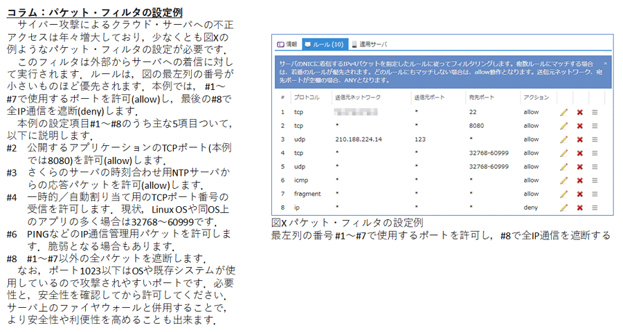

-------------------------------------------------------------------------------
# udp_monitor_chart.py

UDPで受信したIoTセンサ機器の値を棒グラフで表示します。  
-------------------------------------------------------------------------------

下記は、さくらのクラウドを使った時のパケットフィルタの設定例です。  
無保証です。  

## 参考文献
https://manual.sakura.ad.jp/cloud/network/packet-filter.html#id12  
https://knowledge.sakura.ad.jp/7133/  

-------------------------------------------------------------------------------
# jpg2header.py

Jpegファイルをヘッダファイルに変換します  

-------------------------------------------------------------------------------
# signage_serv.py

ex17_signage デジタル・サイネージ for M5Stack にコンテンツを配信するHTTPサーバ
・一般ユーザ(piユーザなど)で使用するとポート番号8080でHTTPサーバが起動します。
・インターネット・ブラウザなどでアクセスするとコンテンツを応答します。
・サーバ上で動作確認する場合は http://127.0.0.1:8080/ にアクセスしてください。

by bokunimo.net(https://bokunimo.net/)
- ブログ (https://bokuniomo.net/blog/)
- M5Stackのブログ (https://bokunimo.net/blog/menu/m5stack/)
